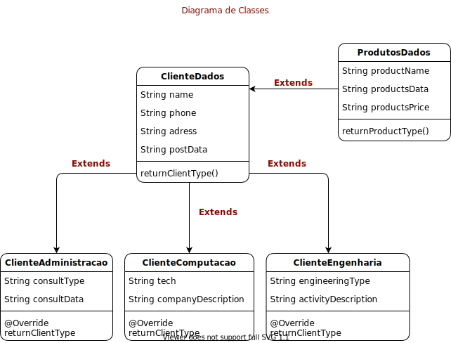

<h1 align="center">📦 Sistema: Cadastro de Produtos</h1>

  

> Projeto requisitado pelo professor [_Edson Mota_](https://www.linkedin.com/in/edsonmottac/) como forma avaliativa da **Formativa II** de POO.

Totalmente feito em Java utilizando pacotes da própria linguagem.

## 📢 Sobre o Projeto

O projeto tem como objetivo facilitar o cadastro de um usuário na aplicação que ele possuí, onde é necessário fazer a distinção entre consumidores do tipo **Computação**, **Administração** e **Engenheiro**. Cada tipo de usuário vende e compra um determinado produto, a aplicação vem para facilitar o cadastro desses clientes e suas determinadas requisições.

## 📜 Diagrama de Classes

Este diagrama foi desenvolvido no [draw.io](https://draw.io/) o modelo criado por mim pode ser encontrado clicando [aqui](assets/template/diagramaDeClasses.drawio) ou acessando a pasta `assets/template/`. Construi este diagrama era também parte avaliativa da **Formativa II**, após o desenvolvimento dele e utilizando como auxilio na codificação a resolução do problema se tornou fácil.

Analisando o diagrama de classes, é possível entender o que é cada classe, o que ela faz, o que ela tem e como ela funciona. Como por exemplo a classe **ClienteDados** alimenta os tipos de clientes e a classe **ProdutoDados** alimenta os dados dos produtos destes clientes.

## 🎯 Dependências para rodar a aplicação

- `Java 11.0 +`
- `Compilador Java.`
- `Draw.io` para a visualização do diagrama de classes.

## 📚 Oque aprendi nesse projeto ?

- Utilização de overcharge nos metodos `@Override`.
- Refatoração de classes.
- Utilizar herança de classes.

## 👨🏾‍🦱 Equipe composta por

- Lucas Pereira Souza.

  
  

  📩 lucasp.sdev@gmail.com
  

---

Desenvolvido com 💘 por Lucas Souza.

